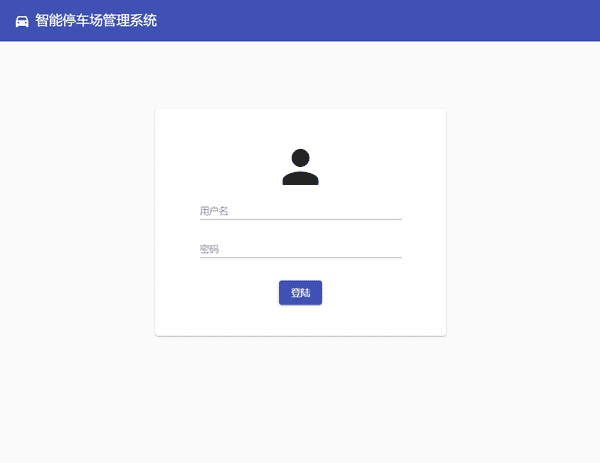
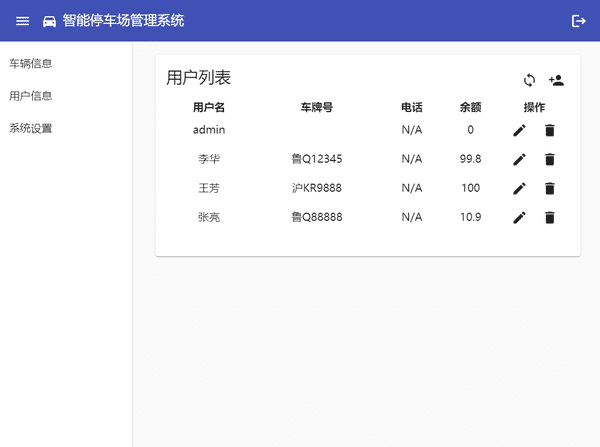
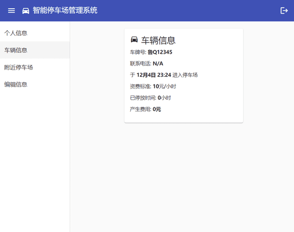
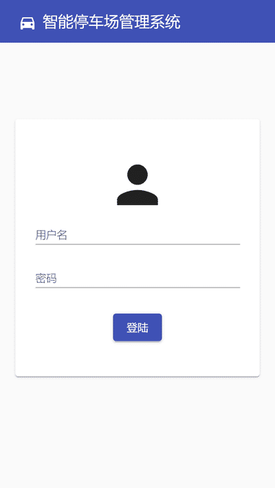
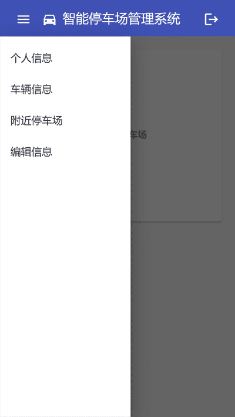
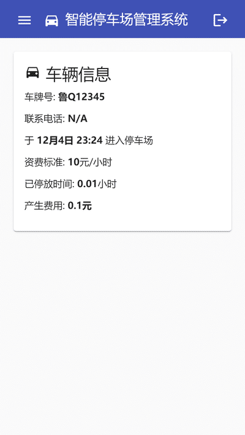

# 在线停车场管理系统

后端: StringBoot + MyBatis

前端: Angular

## 界面
管理界面

用户界面 - 手机版

This project was generated with [Angular CLI](https://github.com/angular/angular-cli) version 7.1.4.

## Development server

Run `ng serve` for a frontend dev server. Navigate to `http://localhost:4200/`. The app will automatically reload if you change any of the source files.

Then, run gradle task `bootRun` for a backend dev server. Navigate to `http://localhost:8080/`.

## Code scaffolding

Run `ng generate component component-name` to generate a new component. You can also use `ng generate directive|pipe|service|class|guard|interface|enum|module`.

## Build

First, run `ng build` to build the frontend project. The build artifacts will be stored in the `src/main/resources/static` directory. Use the `--prod` flag for a production build.

And then, run gradle task `bootJar` to pack frontend build artifacts to Jar

## Running unit tests

Run `ng test` to execute the TypeScript unit tests via [Karma](https://karma-runner.github.io).

Run gradle task `test` to execute the Java unit tests via Junit.

## Further help

To get more help on the Angular CLI use `ng help` or go check out the [Angular CLI README](https://github.com/angular/angular-cli/blob/master/README.md).
